# MapleNest – AI-Powered Housing Insights Platform

🏆 [**1st Place Winner – Seneca Hackathon 2024**](https://factory.cancred.ca/obv3/credentials/d9477538d77d167704afb3142410a2159d4e042a)

Developed as a team project with:
- Abdullah Al Mamun Fahim
- Andrii Sych
- Cleo Buenaventura
- Fevin Patel
- Majd Al Mnayer

MapleNest is a full-stack web application that provides AI-powered, data-driven insights into housing demand and rental pricing.

The platform allows users to explore neighborhoods and analyze interest trends based on user interactions. It integrates a machine learning model trained on 10 years of Toronto rental data to predict future rent prices based on location, apartment type, and a selected date.

Additionally, MapleNest features an AI assistant powered by OpenAI, enabling users to ask questions about specific neighborhoods. The assistant is custom-prompted to provide focused, relevant insights to support better housing decisions.

## Features

- Explore neighborhoods and housing trends  
- Track user interest by neighborhood and apartment type  
- Visualize housing demand through charts and analytics  
- AI-powered rent prediction using historical Toronto housing data  
- AI assistant for neighborhood-specific insights  
- Integration with external rental platforms for real listings  

## Tech Stack

- **Frontend:** React, Tailwind CSS, shadcn/ui  
- **Backend:** Node.js
- **Database:** Azure Cosmos DB  
- **Machine Learning:** Azure ML (rent prediction model)  
- **AI Integration:** Azure OpenAI (neighborhood assistant)  
- **External APIs:** Google Maps API (neighborhood data and Street View visualization)

## Key Highlights

- Built a full-stack rental platform with real-time data tracking  
- Designed a system to collect and analyze user interest across locations and property types  
- Visualized demand trends using charts and structured data  
- Created a scalable UI using React, Tailwind CSS, and component-based architecture  
- Explored how data can inform real-world housing decisions  

## Concept & Impact

MapleNest is designed as a housing intelligence platform that combines user interaction data, machine learning, and AI to provide insights into rental demand and pricing.

By analyzing user interest across neighborhoods and apartment types, the system identifies trends in housing demand. These insights are paired with a prediction model trained on 10 years of rental data, allowing users to estimate future rent prices based on location and property type.

The platform also integrates an AI assistant to provide contextual, neighborhood-specific information, helping users better understand the areas they are exploring.

Together, these features demonstrate how data-driven tools can support more informed decision-making for both renters and developers.

## Demo

Watch a full walkthrough of MapleNest, including rent prediction, AI assistant, and data visualization features.

👉 https://youtu.be/tzBnxkelEtE

## Screenshots

### Neighbourhood rent price prediction and analysis

A rent price prediction for the selected neighbourhood, apartment type, and date.

  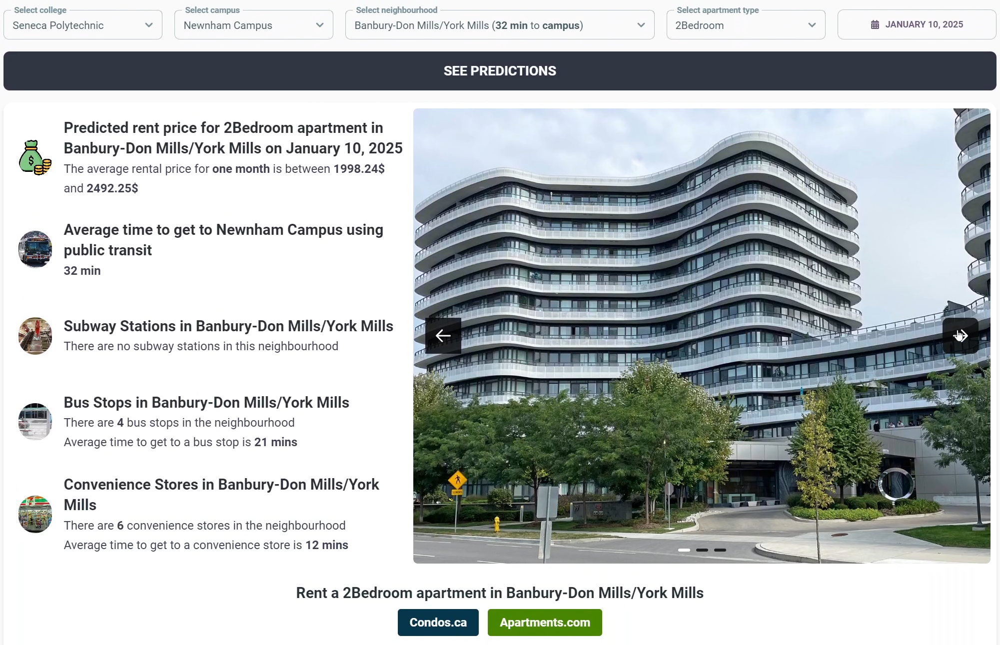

An overview of the selected neighbourhood with a short description and a cost analysis.

  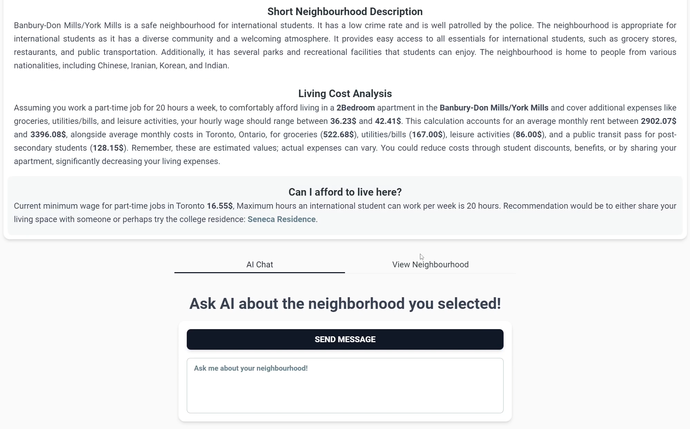

MapleNest AI assistant custom-prompted to answer questions regarding the neighbourhood.

  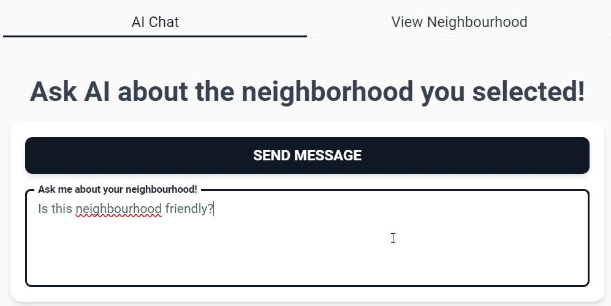
  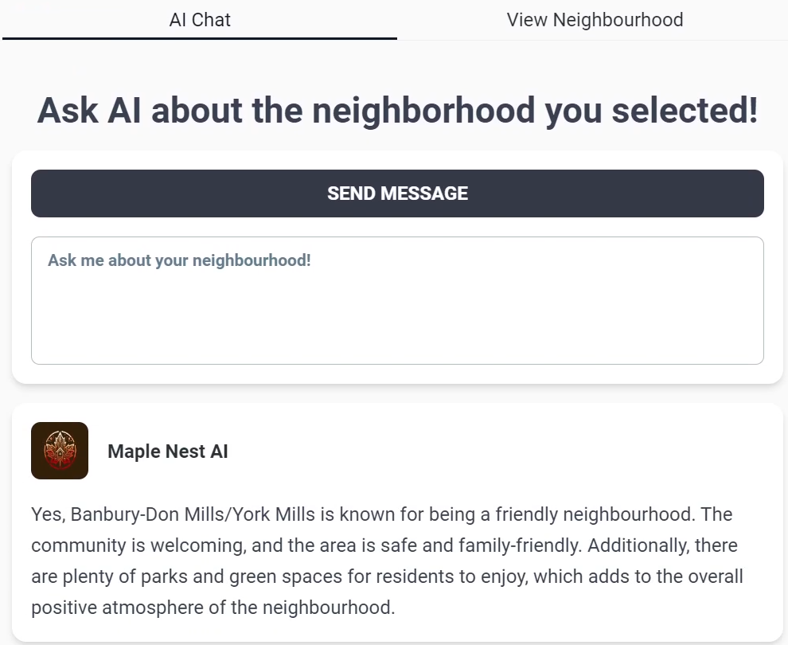

  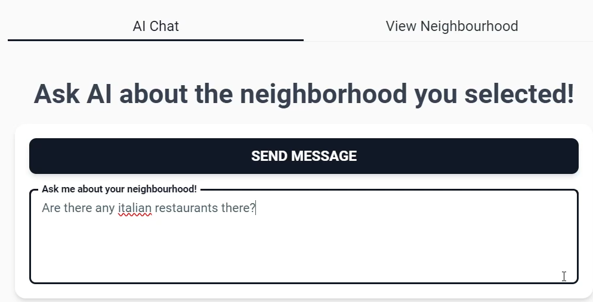
  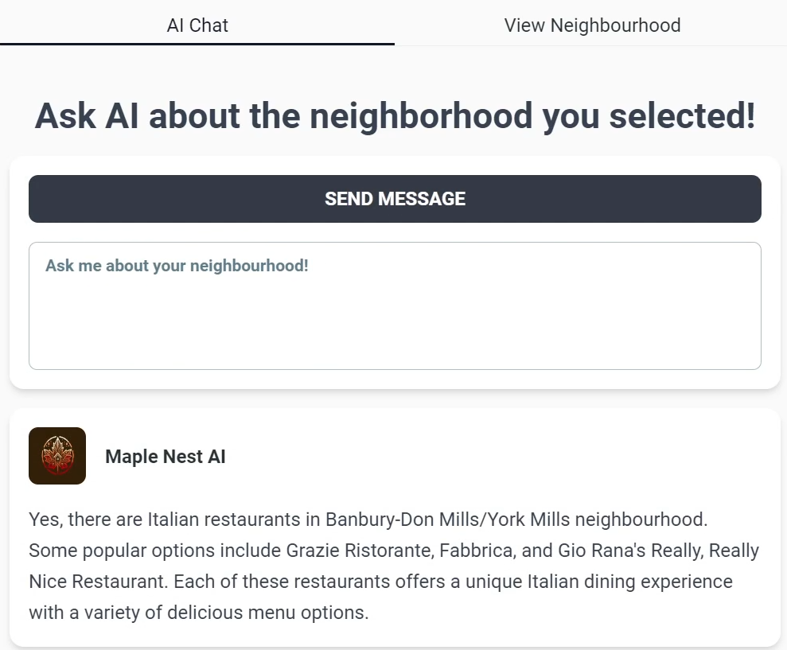

  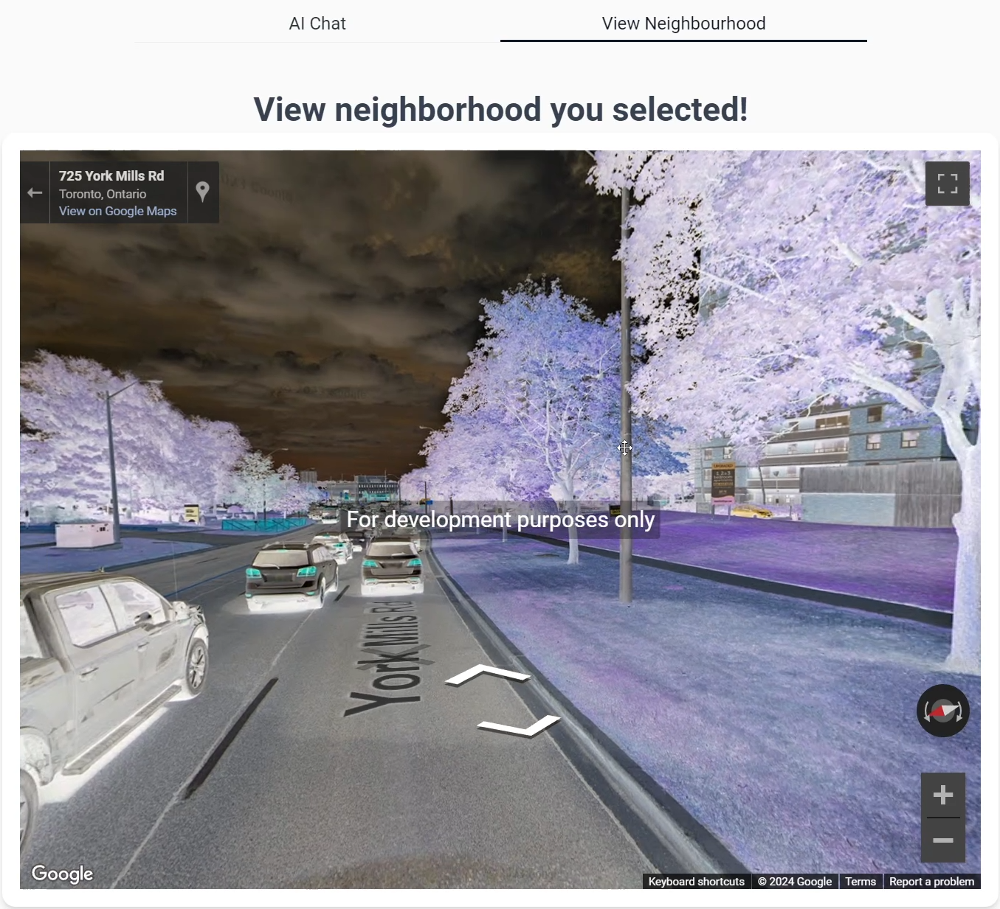

### Compare two neighbourhood predictions and analysis

A side-by-side comparison of rent price predictions and analysis of two different neighbourhoods.

  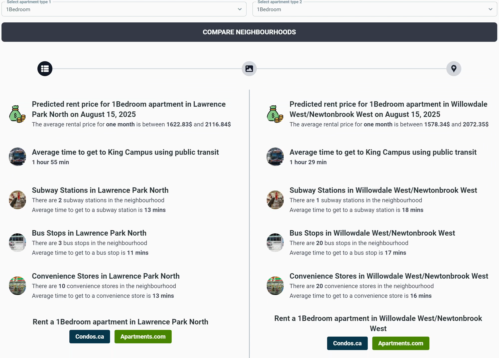

  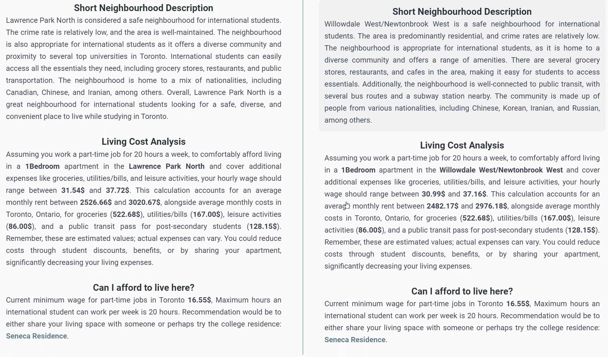

  

  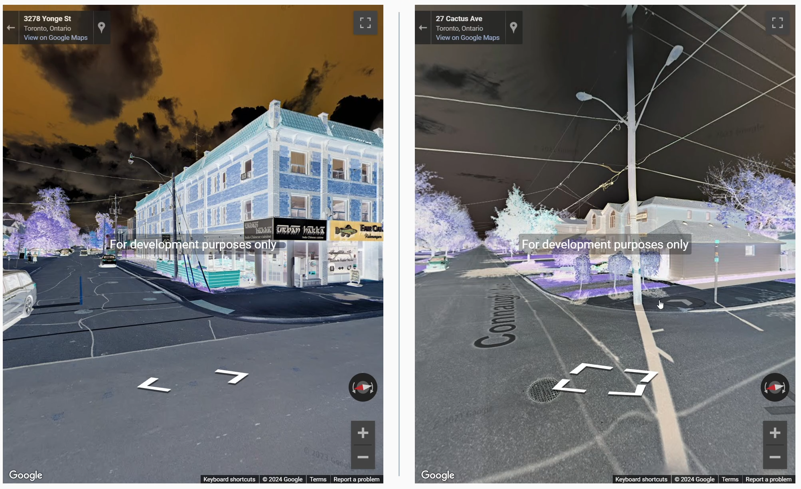

### Neighbourhood and Apartment type interest analysis

A graph depicting the amount of interest a specific neighbourhood has along with more details in a downloadable pdf.

  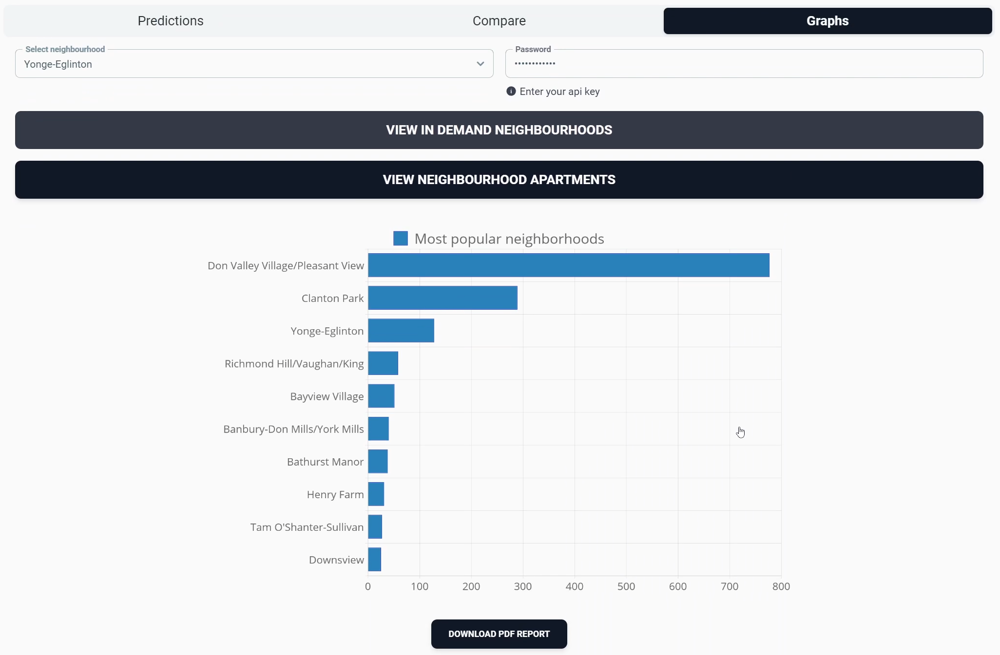

  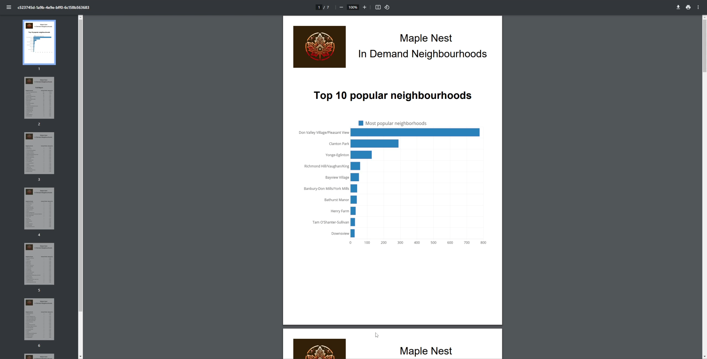

  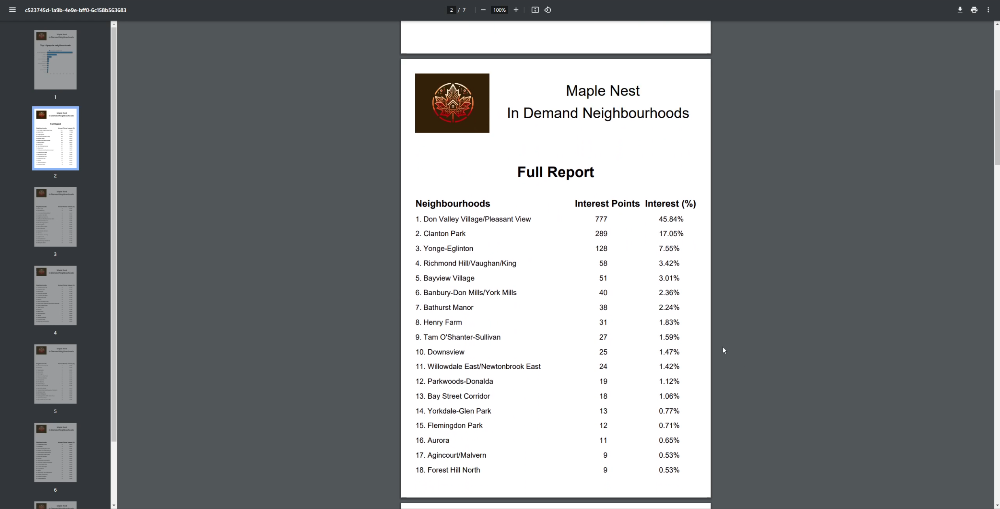

A chart depicting the amount of interest for a specific apartment type within the selected neighbourhood with more details in a downloadable pdf.

  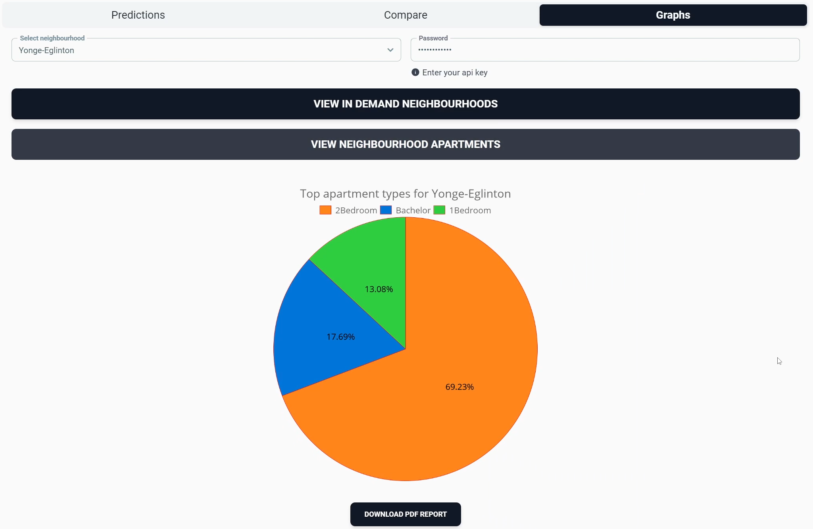

  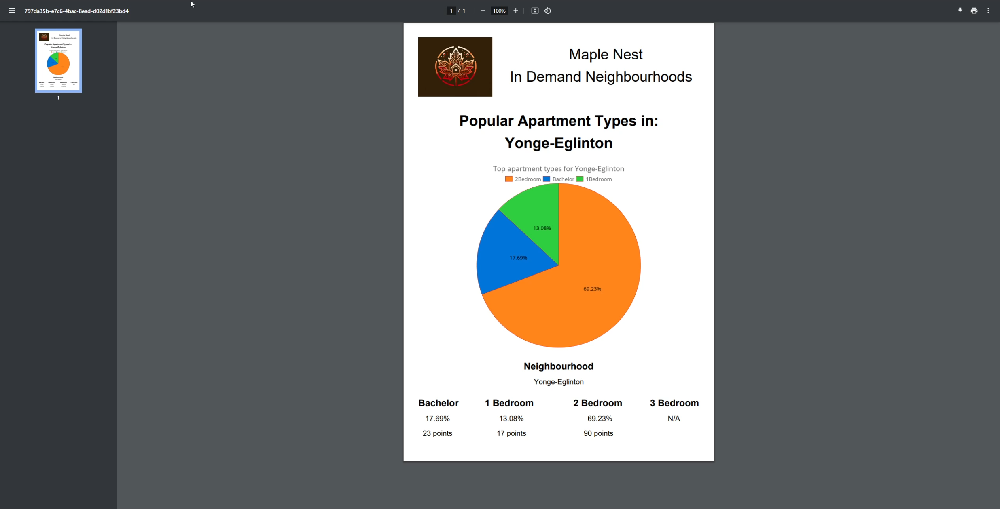

### ⚠️ Disclaimer

MapleNest does not host or manage rental property listings. The application includes links to external rental platforms to demonstrate how users can explore real listings based on selected criteria.

MapleNest is not affiliated with, endorsed by, or partnered with these platforms.
